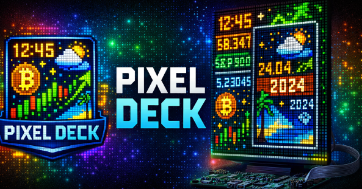

# 🖥️ Pixel Deck


---

## 📌 Project Description

**Pixel Deck** is a modular Python application designed to control a 64×64 RGB LED matrix (e.g. running on a Raspberry Pi with [`rpi-rgb-led-matrix`](https://github.com/hzeller/rpi-rgb-led-matrix/tree/master)).  

It renders dynamic scenes such as clock, weather, stock market data, cryptocurrency prices, images, and custom text.

The system is built with clean scene abstraction, centralized configuration, and hardware-independent rendering logic. It supports both development mode (window renderer) and production mode (LED matrix on Raspberry Pi via Docker).

---

## 🎯 Project Goals
- Provide a clean and extensible scene-based LED display framework
- Enable easy configuration via YAML
- Support Raspberry Pi deployment via Docker
- Keep scenes modular, reusable, and standardized
- Make adding new scenes simple and consistent
- Maintain clean logging and structured architecture

---

## 🔌 Setup

### 🛠 Used Technologies
- Python 3.11+
- `rpi-rgb-led-matrix`  (via Raspberry Pi)
- Docker & Docker Compose

### 🧩 Used Hardware
- Raspberry Pi 4 / 5
- Adafruit RGB Matrix HAT
- 64×64 RGB LED panel (HUB75, typically 1/32 scan)

---

## 🔗 Wiring Overview (Based on Adafruit Documentation)
This setup follows the official guide from Adafruit:  
https://learn.adafruit.com/adafruit-rgb-matrix-plus-real-time-clock-hat-for-raspberry-pi/matrix-setup

### 🧩 Step 1 – Mount the HAT

- Place the **Adafruit RGB Matrix HAT** directly onto the Raspberry Pi GPIO header
- Ensure all pins are properly aligned

### ⚡ Step 2 – Power the Panel


- Use a **separate 5V power supply**
- Connect:
  - VCC → panel power input
  - GND → panel ground

> [!Important]
> Do NOT power the panel from Raspberry Pi
> Always share **common ground** between PSU and Raspberry Pi

### 🔌 Step 3 – Connect the HUB75 Cable


- Connect the ribbon cable:
  - HAT → panel **INPUT**
- Pay attention to:
  - Arrow direction on panel (IN → OUT)
  - Red stripe on cable = Pin 1

### 🔁 Signal Flow

***Raspberry Pi → HAT → HUB75 Cable → LED Panel***

### 🔧 E Line Fix (Important)

Some 64×64 panels require remapping:

- The **E line must be connected to GPIO 8**
- Often requires **manual rewiring or soldering**


**Symptoms without fix:**
- Shifted rows
- Broken rendering
- Random flickering

---

## 🎬 Supported Scenes

Currently implemented scenes:

| Scene         | Description                                    |
|---------------|------------------------------------------------|
| `clock`       | Digital clock (configurable format & timezone) |
| `calendar`    | Current date (DD.MM + YYYY)                    |
| `weather`     | Weather from Open-Meteo API                    |
| `bitcoin`     | Bitcoin price from CoinGecko                   |
| `sp500`       | S&P 500 data from Stooq                        |
| `text`        | Dynamic multi-line text with word wrapping     |
| `images`      | Random image display                           |
| `day_state`   | Day state from Open-Meteo API                  |
| `f1_calendar` | F1 next race from Jolpi API                    |
| `registry`    | (Reserved / internal usage)                    |

>[!NOTE]
>All scenes share a standardized lifecycle and configuration structure.

---

## ⭐ Key Features

- 🧩 Modular scene architecture
- ⚙ YAML-based configuration
- 🔁 Scene rotation mode
- 📡 External API integration (Weather, Crypto, Stocks)
- 🖼 Image rendering (RGBA support)
- 🧠 Smart text wrapping & scaling
- 🐳 Docker deployment on Raspberry Pi
- 🪵 Structured logging
- 🖥 Development window renderer

---

## 📂 Project Structure

```
Pixel_Deck/
│
├── assets/
│ └── images/
├── src/
│ ├── core/
│ │ ├── app_config.py
│ │ └── logging_config.py
│ ├── gfx/
│ │ ├── draw.py
│ │ ├── font5x7.py
│ │ └── image_loader.py
│ ├── renderer/
│ │ ├── base_renderer.py
│ │ ├── matrix_renderer.py
│ │ ├── renderer_factory.py
│ │ └── window_renderer.py
│ └── scenes/
│ ├── base_scene.py
│ ├── bitcoin.py
│ ├── calendar.py
│ ├── clock.py
│ ├── day_state.py
│ ├── f1_calendar.py
│ ├── images_random.py
│ ├── registry.py
│ ├── show_app_logo.py
│ ├── sp500.py
│ ├── text.py
│ └── weather.py
├── config.yml
├── main.py
├── requirements.txt
├── Dockerfile
└── docker-compose.yml

```

---

## 🏗 Architecture Overview

### Scene-Based Architecture

Every scene inherits from `BaseScene`.

```
BaseScene
↑
├── ClockScene
├── CalendarScene
├── WeatherScene
├── BitcoinScene
├── SP500Scene
├── TextScene
├── DayStateScene
├── F1CalendarScene
└── ImagesRandomScene
```


### Scene Lifecycle

Each scene follows the same structure:

```python
class ExampleScene(BaseScene):

    def on_enter(self):
        ...

    def on_exit(self):
        ...

    def update(self, dt: float):
        ...
```

Standardized internal structure:
- `_init_state_defaults()`
- `_load_config()`
- `_init_clients()` (optional)
- `_load_assets()` (optional)
- `_reset_timers()` (optional)
- `_render()` (optional)

This guarantees consistency across all scenes.

---

## ⚙ Configuration

Configuration is handled via `config.yml`

### Global Sections
- `display` – hardware & matrix settings
- `scene_defaults` – fallback values for all scenes
- `app` – runtime behavior
- `scenes` – individual scene configuration

### Example Scene Configuration

```yml
scenes:
  clock:
    enabled: true
    duration_s: 5
    format: "%H:%M"
    layout:
      time:
        y: 22
        scale: 2
```

Each scene can override:
- `duration_s`
- `refresh_s`
- `background`
- `font`
- `layout`
- `data`

---

## 🧠 How Configuration Works

1. `scene_defaults` defines global fallback values.
2. Each scene overrides only what it needs.
3. Scene loads configuration via `_load_config()`.
4. Missing values automatically fallback to defaults.

---

## ➕ Creating a Custom Scene

### Step 1 – Create Scene File
`src/scenes/my_scene.py`

```python
from src.scenes.base_scene import BaseScene

class MyScene(BaseScene):

    def on_enter(self):
        super().on_enter()
        self._init_state_defaults()
        self._load_config()

    def update(self, dt: float):
        if self.renderer is None:
            return
        # draw something
```

### Step 2 – Register Scene
Add it to `registry.py`

### Step 3 – Add Configuration

```yml
scenes:
  my_scene:
    enabled: true
    duration_s: 10
```
### Step 4 – Add to Rotation

```yml
app:
  scene_order:
    - "clock"
    - "my_scene"
```
---

## 🖥 Installation (Development)

```bash
git clone https://github.com/petrsafrata/pixel-deck.git
cd pixel-deck
python -m venv .venv
source .venv/bin/activate
pip install -r requirements.txt
python main.py
```

> [!TIP]
> For development rendering, use:
```yml
  render: "window"
  ```  

## 🐳 Deployment on Raspberry Pi (Docker Compose)

Pixel Deck is designed to run on Raspberry Pi using Docker.

Download the current release, build image and run:
```bash
docker build -t pixel-deck
docker compose up
```

### 🔐 Requirements & Permissions

- You run on Raspberry Pi
- Hardware mapping matches your matrix
- Docker container must run in `privileged` mode for:
    - SPI and GPIO access
- The container must have access to `/dev/mem:/dev/mem` for:
    - Mapping physical memory device (needed for low-level LED matrix control)
- Module `snd_bcm2835` must be disabled in RPi:
    - This module uses hardware resources that interfere with the LED matrix
    - Disable audio in config:
    ```bash
    sudo nano /boot/config.txt
    dtparam=audio=off
    ```
    - Create or edit blacklist config:
    ```bash
    sudo nano /etc/modprobe.d/blacklist-snd.conf
    blacklist snd_bcm2835
    ```

---

## 🧠 Why Dockerfile Patches Pillow

The `rpi-rgb-led-matrix` Python bindings use an **unsafe fast-path for Pillow images**, which accesses image memory directly for better performance.  

In this project (especially inside Docker), this caused:
- build instability of `rgbmatrix.core`
- rendering glitches and incorrect colors
- unpredictable crashes

To ensure stability, the Dockerfile:
- disables the unsafe Pillow fast-path (replaces it with a safe stub)
- forces `SetImage(..., unsafe=False)` by default
- explicitly blocks the unsafe mode

### Tradeoff

- ✅ stable and predictable rendering  
- ❌ slightly lower performance  

For Pixel Deck, **stability is more important than raw speed**, so the safe path is enforced.

---

## 🐞 Troubleshooting

### 🎨 Wrong colors
- Check:
```yml
led_rgb_sequence: "RGB"
```
- Check power supply
    - The HAT has a problem with correct color rendering at high brightness, try reducing the brightness or connecting a separate 5VDC input power supply to the HAT
    ```yml
    brightness: 40
    ```

### ⚡ Flickering pixels
- Increase:
```yml
gpio_slowdown: 10
```
- Adjust:
```yml
pwm_lsb_nanoseconds: 200–300
```

### 🧱 Distorted output
- Check resolution:
```yml
rows: 64
cols: 64
```
- Verify E → GPIO8

---

## ⚠ Known Issues

- Some panels require manual E-line fix
- Cheap power supplies cause instability
- Docker adds slight rendering overhead
- High brightness may require dual power input
- Incorrect power supply is the #1 cause of color issues and flickering

---

## 🤝 Contributing

Contributions are welcome!
Feel free to open issues, feature requests, or pull requests to improve the project, add new scenes, enhance performance, or extend the documentation. Please read the [CONTRIBUTING.md](CONTRIBUTING.md) file for details.

## ⚖️ Licence

This project is open-source and released under the Apache License 2.0.
You are free to use, modify, distribute, and use it commercially under the terms of the Apache 2.0 license.
See the [LICENSE](LICENSE) file for full details.
```
Apache-2.0 – Copyright (c) 2025 Petr Šafrata
```
---